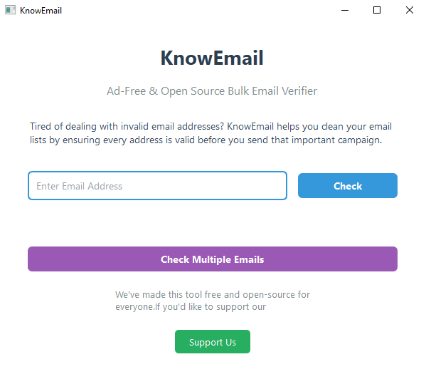

<div align="center">

<picture>
  
</picture>

An Open Source Email Verifier &amp; Validator.
<h3>

By [OpenInitia](https://github.com/OpenInitia)
</h3>

Maintainer - [@Deadpool2000](https://github.com/Deadpool2000)

[](https://github.com/OpenInitia/KnowEmail)
[](https://img.shields.io/github/stars/OpenInitia/KnowEmail)
[](https://github.com/OpenInitia/KnowEmail/issues)
[](https://github.com/OpenInitia/KnowEmail/graphs/contributors)
[](https://github.com/OpenInitia/KnowEmail/blob/main/LICENSE)


<picture>
  
</picture>
</div>

KnowEmail is a robust, open-source email verification and validation tool designed to ensure that email addresses in their applications are valid, safe, and properly formatted. Whether you're looking to reduce spam, improve data quality, or simply verify user input, KnowEmail offers a reliable solution for your email verification needs.

## Table of Contents

- [Features](#features)
- [Installation](#installation)
- [Usage](#usage)
- [Contributing](#contributing)
- [License](#license)
- [Contact](#contact)

## Features

- **Email Syntax Validation:** Ensures the email address adheres to proper format.
- **Domain Verification:** Checks for the existence of the email's domain and associated DNS records.
- **MX Record Check:** Confirms that the email domain is configured to receive emails.
- **Real-time Verification:** Provides quick and accurate results.
- **Extensible Architecture:** Easily integrated and extended to meet custom requirements.

## Installation

### Clone the Repository

Clone the repository to your local machine:

```bash
git clone https://github.com/OpenInitia/KnowEmail.git
cd KnowEmail
```

### Setup Environment

If using Python, install the required dependencies:

```bash
pip install -r requirements.txt
```

*Note:* If you’re integrating KnowEmail into another project or using a different language, please refer to the appropriate setup instructions in the project documentation.

## Usage

You can run KnowEmail either from the command line or integrate it directly into your projects.


```bash
python3 main.py
```

### You can check
1) Single Email
2) Bulk Emails (By using .txt or .xlsx file)


*Tip:* Customize the script or integrate additional checks as needed for your specific application.

## Download Options
### Windows Users:
The current release of KnowEmail is available as an executable (.exe) for Windows users only. Download the latest Windows executable from the Releases page. [Download Here](https://github.com/OpenInitia/KnowEmail/releases)

### Future Support:
We are actively working on packages for macOS, Linux, and Android. Stay tuned for updates!

## Contributing

Contributions are welcome! If you have any ideas, please contribute!

## License

This project is licensed under the [GNU GPL 3.0 License](LICENSE). See the LICENSE file for details.

## Contact

For any questions, suggestions, or support, please reach out:

- **Maintainer:** [@Deadpool2000](https://github.com/Deadpool2000)
- **Open an Issue:** [GitHub Issues](https://github.com/OpenInitia/KnowEmail/issues)
